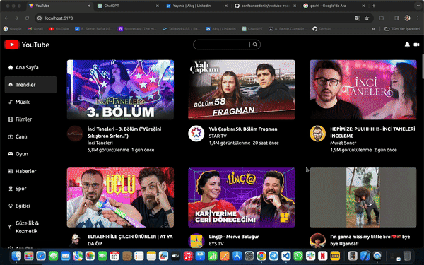

# Library

- react-icons
- react-router-dom
- axios
- react-player (video oynatma)
- moment (zaman formatlama)
- millify (sayı formatlama)
- tailwind (stillendirme) (kurulum sitesinde)

# API

- API: https://rapidapi.com/ytjar/api/yt-api

# YouTube

Hi! I'd like to share with you a new project I developed using React: a YouTube clone! In this project, I utilized several different libraries, and the result turned out to be quite impressive.

Here are some of the features that might catch your interest:

React-Icons: Used to add visually appealing icons.
React-Router-Dom: Employed for navigation between pages.
Axios: Utilized for fetching data from the YouTube API.
React-Player: Chosen for playing YouTube videos.
Moment: Used to display dates and times in a user-friendly manner.
Millify: Employed to make numbers more readable.

Additionally, I used Tailwind CSS to ensure responsive design, enabling the project to seamlessly function across different devices.

Since I dynamically fetch data from the API, I want to emphasize that the project always has up-to-date and live content.

Thanks and happy exploring! 🚀

# ScreenShot

